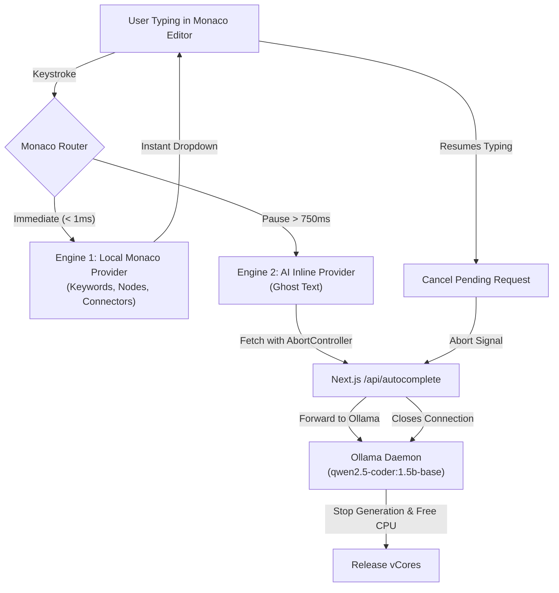

# VPS-Optimized Autocomplete Architecture for Mermaid Designer

Implementing real-time code completion on a CPU-bound server with limited resources (**4 vCores, 4GB RAM**) requires a design that minimizes latency and avoids pinning the CPU. Running an LLM on every keystroke will quickly exhaust server resources and degrade the user experience.

This blueprint details a **Dual-Engine Autocomplete Architecture** designed specifically for your IONOS VPS environment.



---

## 1. Model Selection Analysis

From your `ollama list`, we have several candidates. Below is a comparison of their performance and memory footprint on a CPU-only 4-vCore server:

| Model Name | Size | RAM Footprint | CPU Load / Latency (4 vCores) | Suitability for Autocomplete |
| :--- | :--- | :--- | :--- | :--- |
| **`qwen2.5-coder:0.5b-base`** | **~350 MB** | **~600 MB** | **Minimal (~50-150ms)** | **Winner (Ultra-Light Local)**: Extremely fast CPU generation, 3x faster than 1.5B, tiny memory footprint. Fits perfectly on low-resource VPS nodes for simple Mermaid syntax. |
| **`qwen2.5-coder:1.5b-base`** | **986 MB** | **~1.5 GB** | **Low (~150-350ms)** | **Winner (Medium Local)**: Highly optimized for code, supports FIM syntax, excellent diagram flow logic. |
| **`deepseek-coder:1.3b`** | 776 MB | ~1.3 GB | Low (~150-300ms) | **Runner-Up**: Very light, but Qwen 2.5 has newer code-completion patterns. |
| **`deepseek-v4-flash:cloud`** | `-` | **0 GB** | **0% CPU (Cloud Latency)** | **Winner (Cloud)**: Bypasses VPS limits completely, saving CPU and memory. |
| `llama3.2:1b` / `gemma3:1b` | ~1 GB | ~1.5 GB | Low | Moderate: General purpose, less specialized in code completion than Qwen/DeepSeek. |
| `deepseek-coder-v2:lite` | 8.9 GB | > 9 GB | Extreme (OOM / heavy SSD swapping) | **Unsuitable**: Exceeds your 4GB RAM, causing system crash. |

> [!IMPORTANT]
> **Use the `-base` model variant instead of `-instruct`** for code completions. Instruct models are trained to chat and explain code, whereas base models are optimized for raw text continuation and fill-in-the-middle completion, which is exactly what autocompletion needs.

---

## 2. The Dual-Engine Solution

### Engine 1: Client-Side Syntax Auto-Complete (0% Server Load)
Before invoking an LLM, Monaco can instantly autocomplete Mermaid-specific keywords, connectors, shapes, and syntax using a client-side provider. This is completely free for the server.

```typescript
// Add this in EditorPage.tsx or a separate initialization utility
import { Monaco } from "@monaco-editor/react";

export function registerMermaidAutocomplete(monaco: Monaco) {
  monaco.languages.registerCompletionItemProvider("markdown", {
    provideCompletionItems: (model, position) => {
      const textUntilPosition = model.getValueInRange({
        startLineNumber: 1,
        startColumn: 1,
        endLineNumber: position.lineNumber,
        endColumn: position.column,
      });

      // Only show suggestions inside or starting Mermaid blocks
      if (!textUntilPosition.includes("flowchart") && !textUntilPosition.includes("sequenceDiagram")) {
        return { suggestions: [] };
      }

      const suggestions = [
        {
          label: "flowchart LR",
          kind: monaco.languages.CompletionItemKind.Keyword,
          insertText: "flowchart LR\n    ",
          documentation: "Left-to-Right Flowchart",
        },
        {
          label: "subgraph",
          kind: monaco.languages.CompletionItemKind.Snippet,
          insertText: "subgraph ${1:Title}\n    $0\nend",
          insertTextRules: monaco.languages.CompletionFieldLimitBehavior, // or snippet rules
          documentation: "Subgroup container",
        },
        {
          label: "classDef",
          kind: monaco.languages.CompletionItemKind.Keyword,
          insertText: "classDef ${1:className} fill:${2:#fff},stroke:${3:#333},stroke-width:${4:2px}",
          documentation: "Define CSS styles for nodes",
        },
        // Standard shapes
        { label: "node_round", kind: monaco.languages.CompletionItemKind.Snippet, insertText: "(${1:text})" },
        { label: "node_stadium", kind: monaco.languages.CompletionItemKind.Snippet, insertText: "([${1:text}])" },
        { label: "node_database", kind: monaco.languages.CompletionItemKind.Snippet, insertText: "[(${1:text})]" },
      ];

      return { suggestions };
    },
  });
}
```

### Engine 2: AI-Powered Ghost Text (Debounced & Cancellable)
For context-aware diagram completions (e.g. predicting connection chains or styles based on names), we query `qwen2.5-coder:1.5b-base` via Ollama using Monaco's **Inline Completions API**.

#### Frontend implementation inside `EditorPage.tsx`:
We register an inline completion provider that debounces requests and uses an `AbortController` to cancel running generations the millisecond the user resumes typing.

```typescript
import { useEffect, useRef } from "react";
import { Monaco } from "@monaco-editor/react";

export function registerInlineAICompletions(monaco: Monaco) {
  let abortController: AbortController | null = null;
  let debounceTimeout: NodeJS.Timeout | null = null;

  monaco.languages.registerInlineCompletionsProvider("markdown", {
    provideInlineCompletions: async (model, position, context, token) => {
      // 1. Cancel previous pending completions immediately
      if (abortController) {
        abortController.abort();
      }
      if (debounceTimeout) {
        clearTimeout(debounceTimeout);
      }

      // 2. Setup AbortController for the current fetch
      abortController = new AbortController();
      const signal = abortController.signal;

      // Handle editor-provided cancellation token
      token.onCancellationRequested(() => {
        abortController?.abort();
      });

      // 3. Debounce to prevent querying Ollama on every keystroke
      return new Promise((resolve) => {
        debounceTimeout = setTimeout(async () => {
          try {
            const word = model.getWordAtPosition(position);
            const textBefore = model.getValueInRange({
              startLineNumber: Math.max(1, position.lineNumber - 20),
              startColumn: 1,
              endLineNumber: position.lineNumber,
              endColumn: position.column,
            });

            // Make sure we have enough context or are in a Mermaid block
            if (textBefore.trim().length < 5) {
              return resolve({ items: [] });
            }

            const response = await fetch("/api/autocomplete", {
              method: "POST",
              headers: { "Content-Type": "application/json" },
              body: JSON.stringify({
                prefix: textBefore,
                // If the model supports FIM, pass suffix too
                suffix: model.getValueInRange({
                  startLineNumber: position.lineNumber,
                  startColumn: position.column,
                  endLineNumber: Math.min(model.getLineCount(), position.lineNumber + 10),
                  endColumn: 1,
                }),
              }),
              signal,
            });

            if (!response.ok) throw new Error("API failed");
            const data = await response.json();

            if (data.suggestion) {
              return resolve({
                items: [
                  {
                    insertText: data.suggestion,
                    range: new monaco.Range(
                      position.lineNumber,
                      position.column,
                      position.lineNumber,
                      position.column
                    ),
                  },
                ],
              });
            }
          } catch (err: any) {
            if (err.name !== "AbortError") {
              console.error("AI Autocomplete error:", err);
            }
          }
          resolve({ items: [] });
        }, 750); // 750ms idle delay before hitting the CPU
      });
    },
    freeInlineCompletions: () => {},
  });
}
```

---

## 3. Next.js API Route with Upstream Cancellation

To ensure Ollama stops inference and releases CPU cores when the client aborts, the Next.js API route must propagate the client disconnection back to Ollama.

Create an API endpoint at `app/api/autocomplete/route.ts`:

```typescript
import { NextRequest, NextResponse } from "next/server";

export async function POST(req: NextRequest) {
  const { prefix, suffix } = await req.json();
  const controller = new AbortController();

  // If the browser closes the connection (due to AbortController), cancel the Ollama fetch
  req.signal.addEventListener("abort", () => {
    controller.abort();
  });

  try {
    // Standard Qwen/DeepSeek FIM formatting
    const prompt = `<fim_prefix>${prefix}<fim_suffix>${suffix}<fim_middle>`;

    const response = await fetch("http://localhost:11434/api/generate", {
      method: "POST",
      headers: { "Content-Type": "application/json" },
      body: JSON.stringify({
        model: "qwen2.5-coder:1.5b-base",
        prompt: prompt,
        options: {
          num_predict: 24,       // Limit tokens generated to save CPU cycles
          stop: ["\n\n", "```", "---", "<fim_end>"],
          temperature: 0.1,      // Low temperature for deterministic code
          num_ctx: 1024,         // Low context size to keep RAM usage light
          num_thread: 2,         // Restrict to 2 threads (out of 4 vCores)
        },
        stream: false,
      }),
      signal: controller.signal,
    });

    if (!response.ok) {
      return NextResponse.json({ error: "Failed to generate suggestions" }, { status: 500 });
    }

    const result = await response.json();
    let text = result.response || "";

    // Clean up any remaining FIM tags if present
    text = text.replace("<fim_middle>", "").replace("<fim_end>", "").trimEnd();

    return NextResponse.json({ suggestion: text });
  } catch (err: any) {
    if (err.name === "AbortError") {
      // Gracefully handled request cancellation
      return new Response("Aborted", { status: 499 });
    }
    return NextResponse.json({ error: err.message }, { status: 500 });
  }
}
```

---

## 4. Ollama System Optimization on IONOS VPS

Configure Ollama on your VPS to ensure it operates under strict resource limits and remains warm in memory:

### A. Thread Limiting & Concurrency
By default, Ollama will consume all available CPU cores when generating tokens. We must limit it to **2 cores** to keep the server responsive.

Edit Ollama's service configuration:
```bash
sudo systemctl edit ollama.service
```

Add the following environment variables:
```ini
[Service]
Environment="OLLAMA_NUM_PARALLEL=1"
Environment="OLLAMA_KEEP_ALIVE=-1"
```
* `OLLAMA_NUM_PARALLEL=1`: Queue requests sequentially instead of spinning up parallel resource threads.
* `OLLAMA_KEEP_ALIVE=-1`: Keeps the `qwen2.5-coder:1.5b-base` model loaded in RAM permanently. This avoids the 4-6 second loading overhead and high CPU spikes associated with loading the model from disk on every typing pause.

### B. Verification of Model Footprint
Run a test prediction to verify the model stays warm:
```bash
curl http://localhost:11434/api/generate -d '{
  "model": "qwen2.5-coder:1.5b-base",
  "prompt": "<fim_prefix>graph TD\nA --> B<fim_suffix><fim_middle>",
  "options": { "num_predict": 5 }
}'
```

Verify memory usage using:
```bash
ollama ps
```
The output should confirm `qwen2.5-coder:1.5b-base` is actively loaded, consuming around **1.2 GB - 1.5 GB** of RAM. This leaves a healthy **2.5 GB** of RAM on your 4GB VPS for system services and Node.js.
